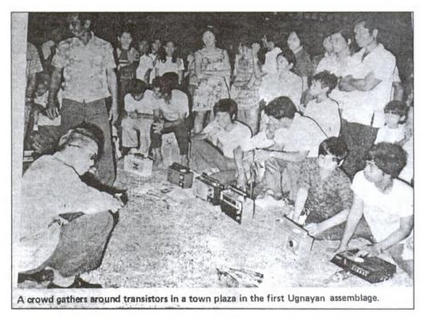
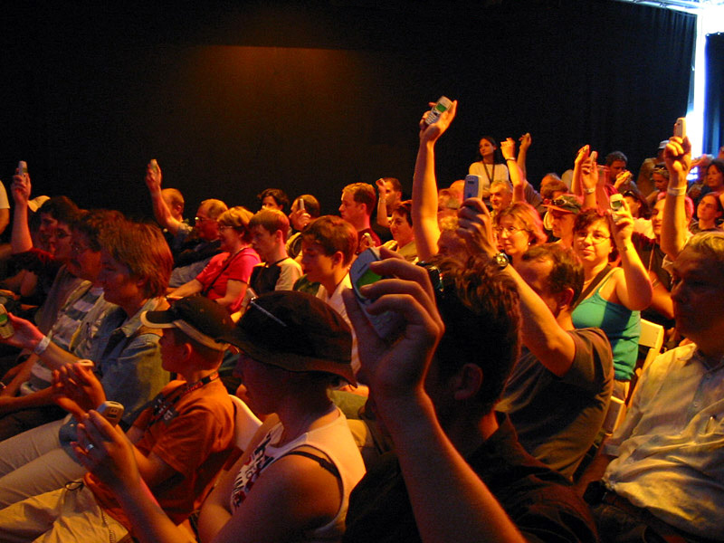
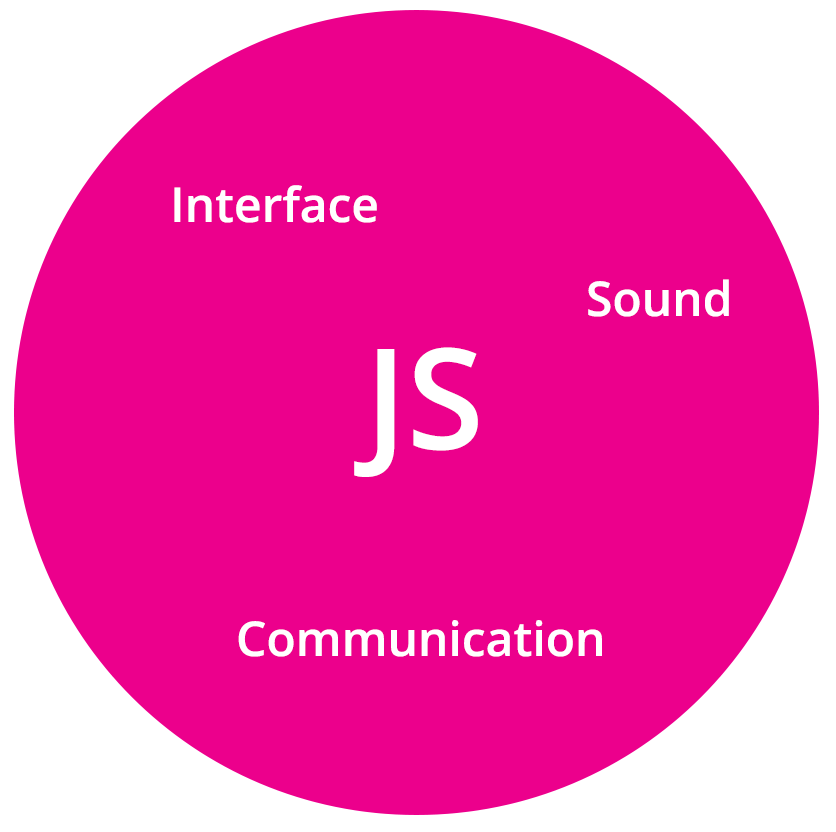

# Distributed Music Workshop

Leaders: Sebastien Piquemal (Helsinki, Finland) & Ben Taylor (Massachusetts, US)


### Outline

Introduction <br>
Discussion: Concept & History <br>
[Installation](#installation) <br>

​

[WebPd](#webpd) <br>

[NexusUI](#nexusui) <br>
[Rhizome](#rhizome) <br>
[Templates](#templates)

**Lunch**

Develop Your Instrument<br>
Investigation of different strategies / interfaces / synths <br>
Performance


# Introduction


### History

This history of distributed music precedes the smartphone by several decades. (For more on this, come to my [paper](media/history-audience-speaker.pdf) presentation on Thursday!)

In 1974, Jose Maceda's [Ugnayan]() is the first work identified with this genre of performance. He was able to broadcast a 1 hour multi-track *musique concrete* composition over approximately 30 radio stations in Manila, Philipines. The event was highly publicized and city-goers were encouraged to take their radios out into the street to realize the piece.

Maceda’s assistant Ramo ́n Santos notes how Maceda used the unique performance format as a compositional mechanism:

> Instead of reprocessing and reshaping these sounds electronically in a studio, Maceda utilized the human energies and the physical space of town plazas and parks to reprocess the sounds in semi-improvised dispersion schemes.

In other words, Maceda used distribution and participation, rather than the studio, as a means to compose musique concrete, to transform *objet sonores* into music.



We see this model in many other distributed music performances over the past 2 decades, including Golan Levin's *Dialtones: A Telesymphony* (2001). The composers installed custom ringtones on the audience's phones, and gave them precise seating locations, giving the composers control over both harmonic and spatial aspects.



There have been many more performances in this model since 2001 — check the paper!


### How Javascript Enables Distributed Music

Contemporary developments in Javascript enable distributed music, and have led to its proliferation.

- Web Audio API: Web audio, a full-featured synthesis engine in the browser, allows websites to become distributed music instruments. This makes for much quicker setup.

  - In addition to WebPD, you might want to check out the Web Audio API and/or Tone.js.

- Socket.io:

  ​

Javascript has really expanded from its original use as an interaction engine, to a language that encompasses interface, communication, and sound — all the elements needed to create a distributed performance.




### Our toolkits

links to our 3 toolkits here...


# Command-line / terminal / console

Is a program that allows you to run commands on your machine by using a text interface. On Linux and OSX it is called `terminal` and on Windows `PowerShell`. We will use it fairly frequently during this workshop.

With the terminal you can navigate your file system, create / edit files, etc ... If you have never used a terminal, no panic. Here a very short primer.

#. to run a command : type it in the prompt, and press enter
#. at any moment in your terminal you are located withing a folder on your filesystem. To list the contents of the current folder, run the command `ls`
#. to navigate to a subfolder directly under your current folder, called for example, *my-files*, run the command `cd my-files`
#. to navigate to the parent folder of your current folder, run the command `cd ..`


# Installation

## Install node with nvm (Linux)

#. Go to [nvm](https://github.com/creationix/nvm#install-script) web page, and copy the one-liner install script. Depending on your distribution, you might not have `curl` installed, so copy the script starting with `wget` instead.
#. Paste that script in a terminal and execute.
#. Then install node by running `nvm install 6` in your terminal.
#. try that `node` and `npm` are installed correctly by running `node -v` and `npm -v`


## Install node with nvm (OSX)

#. Go to [node.js](https://nodejs.org/en/) web page, and run the installer.
#. Open a terminal and try that `node` and `npm` are installed correctly by running `node -v` and `npm -v`


## Install node on windows

#. Download from [Node.js](https://nodejs.org/en/), and run the installer
#. Open PowerShell, and try to run `node -v` as well as `npm -v` to make sure that `node` and `npm` are installed

If running these commands failed, you might need to manually add the node folder to your `PATH` :

#. Figure out first where your node executables are located on your disk, most likely somewhere below `C:\Program Files\nodejs\`.
#. Open windows system settings `System > Advanced system settings > Environment variables` and add the folder you found in the previous step to the `PATH` variable.
#. Restart PowerShell, and try to run again `node -v` and `npm -v` commands.


## Install Pure Data

Download and install Pure Data from the following [page](https://puredata.info/downloads/pure-data).


## Code editor

Install a text editor for programming. Program such as Word or LibreOffice won't work. We recommend [Atom](https://flight-manual.atom.io/getting-started/sections/installing-atom/).


# WebPd


# NexusUI

NexusUI is a set of musical interface components written in HTML, SVG, and Javascript. They will be the interface engine for our distributed music instruments.

This updated version of NexusUI is in a beta period right now, so if you find bugs, please speak up and feel free to [report them on Github]().

A full tutorial on NexusUI is in the [NexusUI API]().

Here are the basics --

### Creating an interface

NexusUI transforms regular HTML elements into interfaces.

Create an HTML element in the body of your document and give it an ID. You can use **div** or **span**.

HTML:

```HTML
<div id="target"></div>
```

JS:

```javascript
var dial = new mt.Dial("target")
```


*Tip: My preferred method is to use a div element with a display style of inline-block. You also might want to give your element a width and height. So your HTML may look something like this:*

```html
<div id="dial" style="width:200px;height:200px;display:inline-block"></div>
```


### Configuring the interface

You can give your interface certain settings when you create it.

```javascript
var dial = new mt.Dial('#target',{
  min: 0,
  max: 1000,
  step: 100,
  value: 500  // its initial value
  interaction: "vertical"
});
```

Check each interface's API for its setting options.


### Listening for interaction events

After you create an interface, you can create an event listener for its interaction:

```javascript
dial.on('change',function(v) {
  // do something with v!
});
```

Check each interface's API for a list of its events. (Almost all interfaces use only a 'change' event, which is called when the interface is interacted with.)


### Sending interaction event data to WebPD

We can integrate NexusUI with WebPD by sending the interface's event data to WebPD.

A good first step is to log your data.

```javascript
dial.on('change',function(v) {
  console.log(v);
});
```

What kind of information is your interface giving you?

 (The answer is also written in the NexusUI API for each interface, under "Events".)

#### If the event data is a number or string:

If your data is a number or text string, you can send it to WebPD directly:

```javascript
dial.on('change',function(v) {
  Pd.send("frequency", [v])
});
```

This will often be the case! Such as with: dial, slider, number.

#### If the event data is a boolean

Some interfaces, such as a toggle, return a boolean (true/false) when interacted with. PD won't understand this exactly, so you will need to convert it to a number, such as 0 and 1.

```javascript
var toggle = new mt.Toggle("#target")

toggle.on('change',function(v) {
  var state;
  if (v) {
    state = 1
  } else {
    state = 0
  }
  // Or, use the shorthand:    
  // var state = v ? 1 : 0;

  // Then send the state number value to PD
  Pd.send('note', [state]);
});
```

#### If the event data is a JS object ( with { } around it )

However, sometimes your interface data might be a Javascript object with several properties, and PD won't understand it. This will especially happen with the more complex interfaces: sequencer, piano, multislider, envelope, etc.

In that case you will need to send each of the properties separately, or create a PD message with multiple items, as in this example:

```javascript
var multislider = new mt.Multislider("#target")

multislider.on('change',function(v) {
  // v.index contains slider number being changed
  // v.value is the new value of the slider
  // we can send them as a combined message to PD
  Pd.send('note', [v.index, v.value]);
});
```

Another good example of this is the *position* NexusUI element — a 2d touch slider with x and y properties:

```javascript
var position = new mt.Position("#target")

position.on('change',function(v) {
  // v.x contains the touch value on the x axis
  // v.y contains the touch value on the y axis
  // we can use them each to control something different:
  Pd.send('frequency', [ v.x * 1000 ]);
  Pd.send('volume', [v.y]);
});
```


#### Full NexusUI / WebPD Example

Cool, let's put it all together!!

You can try this code out in the [Standalone Web Instrument](/standalone) template

```html
<html>
  <head>
    <script type="text/javascript" src="libraries/mt.js"></script>
    <script type="text/javascript" src="libraries/webpd-latest.js"></script>
    <script type="text/javascript" src="libraries/jquery.js"></script>
  </head>
  <body>

    <div id="position" style="widht:100%;height:100%"></div>

    <script>

      /* Load WebPD */

      var patch
      $.get('./pd/main.pd', function(mainStr) {
        // Loading the patch
        patch = Pd.loadPatch(mainStr)
        Pd.start()
      })

      /* Config the UI */

      var position = new mt.Position('#position',{
        minX: 0,
        maxX: 500,
        minY: 0,
        maxY: 1,
        event: function(v) {
          // send v.x and v.y to PD
          Pd.send('frequency', [v.x])
          Pd.send('volume', [v.y])
        }
      })

    </script>

  </body>
</html>
```


# Rhizome


# Templates


### [Standalone web instrument](/standalone/)  

### [One Performer controls N Devices](/one-to-n)

### [N Devices control One Computer](/n-to-one/)

### Device-to-Device Communication

### If Time: One Performer sends a series of interfaces to N Devices
